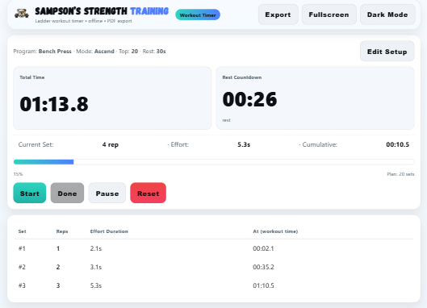

# Ladder Method Workout Timer
>“Train smarter with a ladder workout timer that runs offline, exports to PDF, and keeps you on pace.”

A minimalist **progressive ladder workout timer** built as a **PWA (Progressive Web App)**.  
Designed for strength and conditioning workouts that use ladder-style rep schemes (e.g., 1→10, 10→1, or 1→N→1 pyramid).  

Try it out: [Live Demo](https://sampsonstrength.netlify.app) 🚀

---

## 📸 Screenshots

### Setup Screen (Mobile)


### Workout In Progress


### Workout Log


---

##  Features
-  **Mobile-first UI** with sticky controls
-  **Light/Dark mode toggle**
-  **Optional audio cues** (ding & vibration feedback)
-  **Progress tracking** (total time, per-set effort, cumulative effort)
-  **Workout log** with reps, effort, and timestamps
-  **Export / Print to PDF** for saving or sharing results
-  **Offline-ready (PWA)** with service worker caching
-  **Local storage** remembers your last setup (exercise, top reps, rest, mode)

---

##  How it Works
1. **Set your workout**  
   - Choose exercise name  
   - Select top rep target  
   - Pick ladder mode: Ascend, Descend, or Pyramid  
   - Set rest interval  

2. **Run the ladder**  
   - Tap **Start** to begin  
   - Tap **Done** when a set is complete  
   - Timer auto-manages rest and next set  
   - Log tracks each effort  

3. **Review your results**  
   - See a breakdown of all sets in the log  
   - Export as PDF for records or sharing

 *(For PWA features like offline mode, run with a local server such as `npx serve`.)*
 

---

##  Tech Stack
- **HTML, CSS, JavaScript (vanilla)** – no frameworks  
- **PWA setup** – `manifest.webmanifest` + `sw.js` service worker  
- **LocalStorage** – save last-used inputs  
- **Netlify** (hosting)

---

##  Project Structure
```text
/index.html           # Main app
/sw.js                # Service worker for offline
/manifest.webmanifest
/icons/               # PWA icons
/favicon-*.png        # Favicons
```

## Installation
1. Clone the repository:
   ```bash
   git clone <repository-url>
   ```
2. Navigate to the project folder:
   ```bash
   cd ladder-method-workout
   ```
3. Open `index.html` in your browser to run the app.

## Contributing
Contributions are welcome! Please follow these steps:
1. Fork the repository.
2. Create a new branch:
   ```bash
   git checkout -b feature-name
   ```
3. Commit your changes:
   ```bash
   git commit -m "Add feature name"
   ```
4. Push to your branch:
   ```bash
   git push origin feature-name
   ```
5. Submit a pull request.

## License
This project is licensed under the MIT License.

---
Built with ❤️ by [penningtonProgramming](https://emmettpennington.com)


